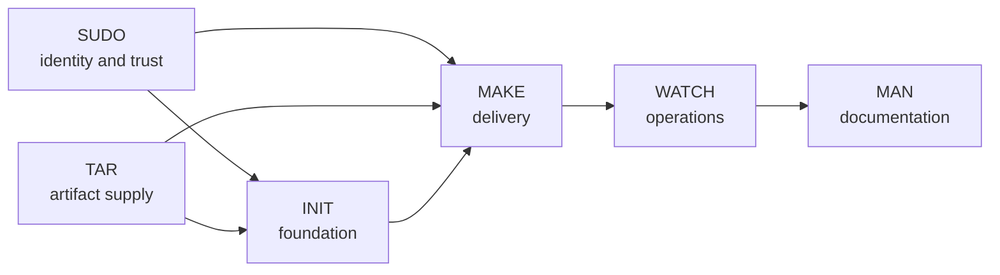

# SHELL

Systems, Hosting, Engineering, Linux and Lifecycle. A self-hosted Linux and Kubernetes platform

## How it fits together

Six parts own the lifecycle, one directory each. Each part hands checked output to the next:

| Directory | Owns | Hands over |
| --- | --- | --- |
| `sudo/` | Identity, access, secrets policy, signing | Trust contracts |
| `tar/` | Images, packages, charts, checksums | Artifact manifests |
| `init/` | Hosts, guests, networking, storage, K3s foundation | Verified foundation |
| `make/` | Kubernetes workloads | Deployed workloads |
| `watch/` | Metrics, logs, alerts, recovery drills | Evidence records |
| `man/` | Architecture, decisions, runbooks | Reviewed documentation |

