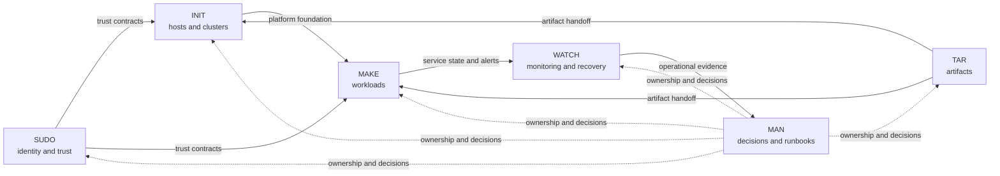

# SHELL

A Linux and Kubernetes infrastructure engineering portfolio.

SHELL organizes platform work into six lifecycle areas: trust, artifact
supply, infrastructure, workload delivery, operations, and documentation.

## Lifecycle

| Area | Focus |
| --- | --- |
| [`sudo/`](sudo/README.md) | Identity, access, signing, and trust contracts |
| [`tar/`](tar/README.md) | Artifact locks, validation, staging, and transfer |
| [`init/`](init/README.md) | GCP, Proxmox, OpenTofu, Ansible, and K3s foundations |
| [`make/`](make/README.md) | Delivery services and Kubernetes workloads |
| [`watch/`](watch/README.md) | Monitoring, read-only checks, and recovery evidence |
| [`man/`](man/README.md) | Architecture decisions and operating records |

## Boundaries

The repository contains source contracts, tests, validators, guarded
controllers, manifests, and documentation. The source checks describe those
files and their safety gates. Provider state, running guests, clusters,
services, artifact publication, and recovery require separate evidence.

## Documentation

- [Platform architecture](man/docs/architecture/platform-nodes.md)
- [Architecture and runbook index](man/README.md)
- [INIT runtime guidance](init/docs/runtime.md)
- [K3s runtime contract](init/docs/k3s-runtime.md)

## Contributing and license

Read [Contributing](CONTRIBUTING.md) before proposing a change. SHELL is
available under the [MIT License](LICENSE).
