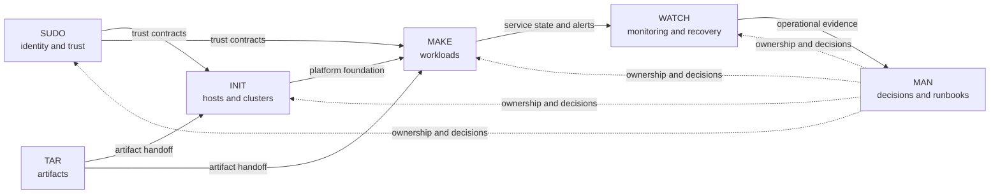

# SHELL

A Linux and Kubernetes infrastructure engineering portfolio.

## Lifecycle

| Area | Responsibility |
| --- | --- |
| `sudo/` | Identity, access, secret-handling, signing, and trust contracts |
| `tar/` | Verified images, packages, charts, manifests, and artifact handoffs |
| `init/` | GCP and Proxmox hosts, guests, networks, storage, and K3s foundations |
| `make/` | Kubernetes workloads, delivery services, platform services, and applications |
| `watch/` | Monitoring policy, read-only verification, recovery, and evidence |
| `man/` | Architecture decisions, operating procedures, and cross-boundary records |

## Build story

The repository is arranged around the work required to bring up and operate
the platform:

1. Establish identity and trust with SUDO.
2. Produce pinned and verified K3s and platform artifacts with TAR.
3. Provision the GCP and Proxmox foundation with INIT.
4. Provision and configure the independent GCP and Proxmox K3s clusters with
   INIT.
5. Deliver Forgejo, platform services, and the release-feed application with
   MAKE.
6. Observe services and run recovery checks with WATCH.
7. Record decisions and operating boundaries in MAN throughout the lifecycle.

## Start here

- [Platform architecture](man/docs/architecture/platform-nodes.md): hosts,
  clusters, networks, and service endpoints.
- [Architecture decisions](man/docs/adr/): the decisions behind the platform.
- [INIT runtime guidance](init/docs/runtime.md): access, secrets, and state.
- [K3s runtime contract](init/docs/k3s-runtime.md): cluster inputs and
  verification boundaries.
- [Release-feed bootstrap](man/docs/runbooks/release-feed-bootstrap.md):
  workload ownership, deployment order, and rollback.
- [WATCH Grafana recovery](man/docs/runbooks/watch-grafana-recovery.md):
  monitoring and recovery policy.
