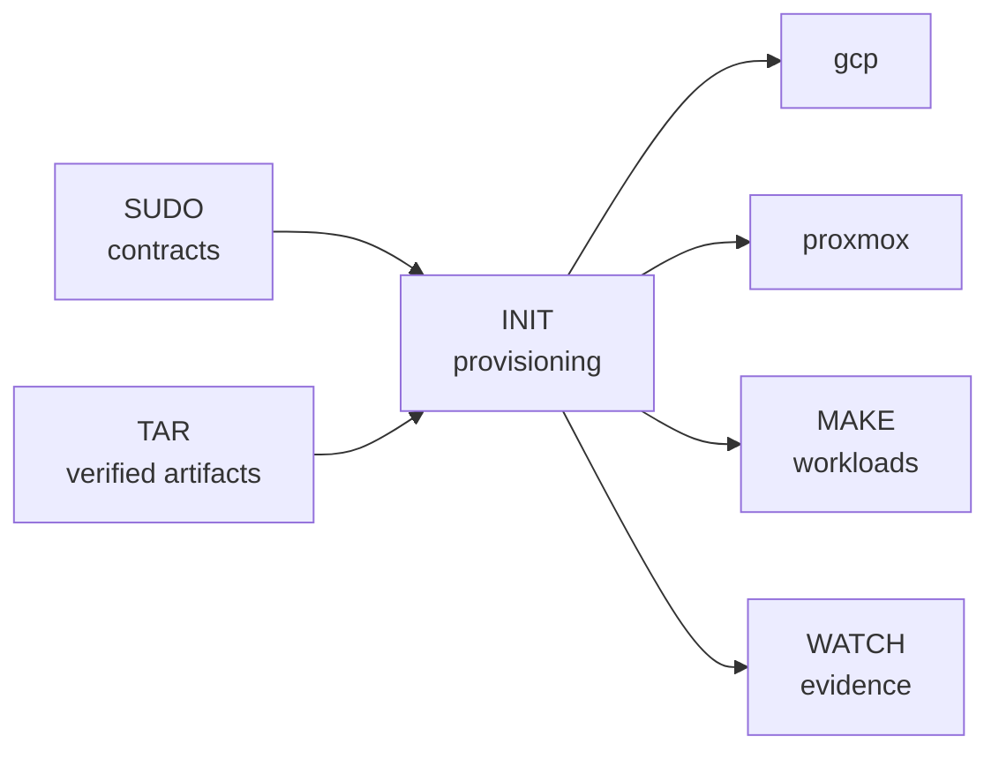

# INIT

> Provisioning boundary for SHELL's direct GCP and Proxmox foundations.

## Overview

INIT provisions the direct-GCP and Proxmox foundations. It consumes SUDO
access contracts and TAR artifacts, declares infrastructure, prepares reusable
guest images, bootstraps hosts and guests, and produces the role-inventory input.

## Documentation

- [Architecture](../man/docs/architecture/platform-nodes.md)

## Contents

- [Infrastructure](opentofu/): shared GCP foundations, the direct-GCP K3s
  cluster, the nested GCP Proxmox host, Proxmox K3s guests, and reusable
  modules.
- [Guest configuration](ansible/): nested-host setup, private inventory
  handoff, and Debian guest verification.
- [Guest images](images/): the pinned Debian `virt-customize` baseline used by
  the Proxmox guests.
- [INIT notes](docs/): runtime inputs and operational boundaries.
