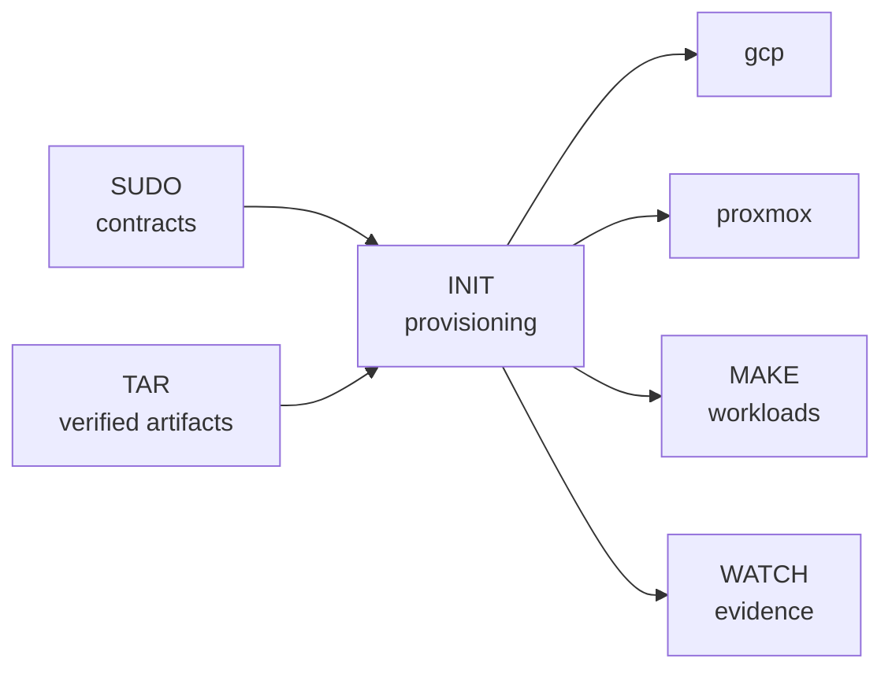

# INIT

> Provisioning boundary for SHELL's direct GCP and Proxmox foundations.

## Overview

INIT provisions the direct-GCP and Proxmox foundations. It consumes SUDO
access contracts and TAR artifacts, declares infrastructure, prepares reusable
guest images, bootstraps hosts and guests, and produces the role-inventory input.

## Documentation

- [Architecture](../man/docs/architecture/platform-nodes.md)
