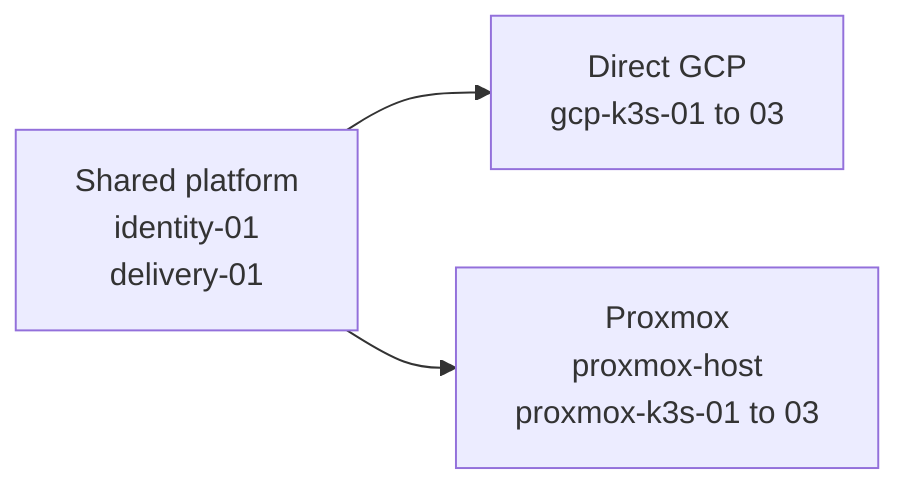

# SHELL platform nodes

The new SHELL implementation defines two independent K3s variants and two
shared platform nodes. This page lists the intended nodes and their placement.
Service endpoints and workload placement are outside its scope.

## Topology

## Shared platform nodes

The shared nodes support both K3s variants. The design places them in the GCP
environment; no separate Proxmox copies are planned.

| Node | Contract address | Role |
| --- | --- | --- |
| `identity-01` | `10.77.0.210` | FreeIPA identity and internal DNS |
| `delivery-01` | `10.77.0.211` | Forgejo and rootless runner |

## GCP K3s Cluster

The primary K3s cluster will run on three direct GCP virtual machines.

| Node | Cluster | Role |
| --- | --- | --- |
| `gcp-k3s-01` | `gcp` | K3s server and embedded etcd member |
| `gcp-k3s-02` | `gcp` | K3s server and embedded etcd member |
| `gcp-k3s-03` | `gcp` | K3s server and embedded etcd member |

## Proxmox K3s Cluster

The Proxmox variant will use one outer host and three K3s guests.

| Node | Placement | Role |
| --- | --- | --- |
| `proxmox-host` | GCP or on premises | Proxmox virtualization host |
| `proxmox-k3s-01` | Proxmox guest | K3s server and embedded etcd member |
| `proxmox-k3s-02` | Proxmox guest | K3s server and embedded etcd member |
| `proxmox-k3s-03` | Proxmox guest | K3s server and embedded etcd member |

The host placement remains open. The GCP option would use one private virtual
machine with nested virtualization. The on-premises option would use one local
host. The K3s guest names will stay the same in either placement.