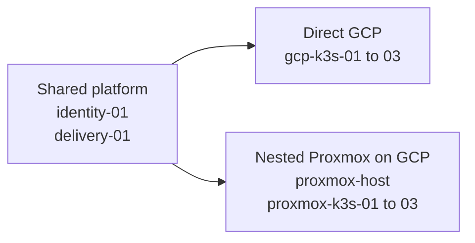

# SHELL platform nodes

SHELL defines two independent K3s variants and two shared platform nodes.
This page lists their intended placement and separates assigned node addresses
from source-defined service frontend addresses.

## Topology

## Shared platform nodes

The shared nodes support both K3s variants. The design places them in the GCP
environment; no separate Proxmox copies are planned.

| Node | Contract address | Role |
| --- | --- | --- |
| `identity-01` | `10.77.0.210` | FreeIPA identity and internal DNS |
| `delivery-01` | `10.77.0.211` | Forgejo and rootless runner |

## GCP service endpoints

The service endpoints use regional GCP internal proxy load balancers. Provider
state and service reachability remain unproven until their authorized gates
run.

| Address | Lifecycle owner | Intended use | Status |
| --- | --- | --- | --- |
| `10.77.0.220` | INIT | `proxmox-host` | Assigned by the GCP host contract |
| `10.77.0.221` | INIT underlay / MAKE backend | Harbor registry and chart source | GCP internal proxy frontend; provider proof pending |
| `10.77.0.222` | INIT underlay / MAKE backend | release-feed HTTPS service | GCP internal proxy frontend; provider proof pending |

The proxy-only subnet is `10.77.2.0/23`. Harbor reaches its Kubernetes HTTPS
NodePort at `30443`, and release-feed reaches `30444`. Argo CD and OpenBao
remain ClusterIP-only. Keycloak is also cluster-local at
`keycloak.shell-identity.svc.cluster.local`; it has no GCP frontend or public
DNS record in the current slice. These are source designs, not deployed
endpoint or reachability evidence.

## GCP K3s Cluster

The primary K3s cluster will run on three direct GCP virtual machines.

| Node | Cluster | Role |
| --- | --- | --- |
| `gcp-k3s-01` | `gcp` | K3s server and embedded etcd member |
| `gcp-k3s-02` | `gcp` | K3s server and embedded etcd member |
| `gcp-k3s-03` | `gcp` | K3s server and embedded etcd member |

## Proxmox K3s Cluster

The Proxmox variant will use one nested Proxmox host and three Debian K3s
guests. The host runs as a private GCP VM with nested virtualization enabled.

| Node | Placement | Role |
| --- | --- | --- |
| `proxmox-host` | Private GCP VM at `10.77.0.220` | Proxmox virtualization host with nested virtualization |
| `proxmox-k3s-01` | Proxmox guest | K3s server and embedded etcd member |
| `proxmox-k3s-02` | Proxmox guest | K3s server and embedded etcd member |
| `proxmox-k3s-03` | Proxmox guest | K3s server and embedded etcd member |

The GCP VPC remains `10.77.0.0/24`. The nested guest bridge uses the separate
`10.66.0.0/24` network with gateway `10.66.0.1`; the three guests use
`10.66.0.201` through `10.66.0.203`. Guest traffic is masqueraded through the
private GCP host, and Ansible reaches guests through that host. The guests use
`identity-01` at `10.77.0.210` as their declared DNS server. The GCP network,
nested bridge, and guest interfaces use an MTU of `1460`.
